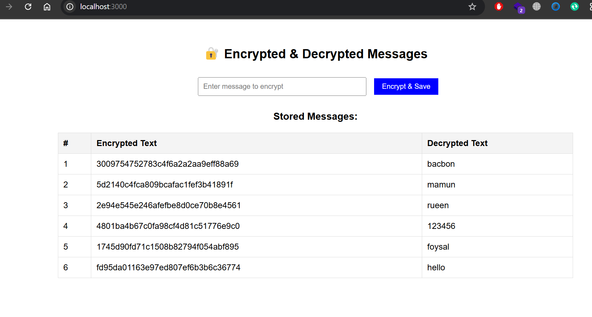

## Add to .gitignore (if not done already)
```
.env
node_modules/
```
## Remove them from Git tracking
```
git rm -r --cached .env node_modules
git commit -m "Removed .env and node_modules from tracking"
git push origin main
```
## Frontend Screen Shot


